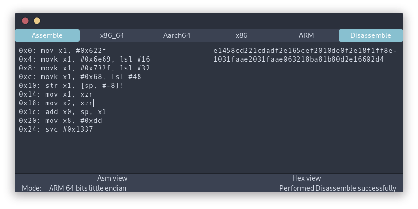

Poor (dis)assembling GTK helper based on Capstone and Keystone engines.

## Installation

```sh
git clone https://github.com/sagittarius-a/guidra.git
cargo install --path guidra
```

## Features

Currently supports the following architectures:

- x86
- x86_64 (default one activated)
- ARM 32 bits little endian
- ARM 64 bits little endian

## Keystone

Keystone bindings are not properly packaged so make sure to keep the `Cargo.toml` content such as:

```toml
[dependencies.keystone]
git = "https://github.com/keystone-engine/keystone"
rev = "c4de98f71f05f356817f5e91fee0d509c7b0b440"  # latest master as of 2019/10/16
```

Using a regular keystone crate such as `keystone = 0.9` will lead to random results. See `https://github.com/keystone-engine/keystone/issues/418` for further details.

## Roadmap

Initially it is a toy project to try out GTK. As of today, no clear roadmap is defined.

## Contributing
Pull requests are welcome. For major changes, please open an issue first to discuss what you would like to change.

Please make sure to update tests as appropriate.

## License
[MIT](https://choosealicense.com/licenses/mit/)